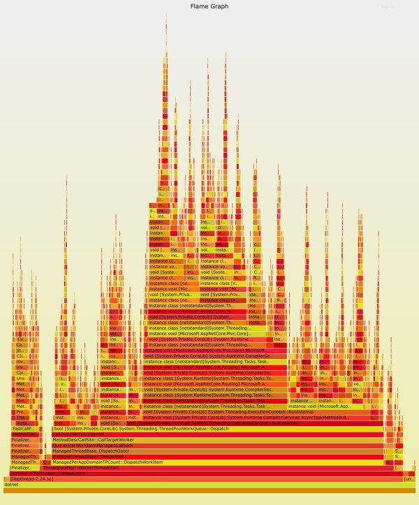

# cpu-profiling

This collection of scripts is designed to support cpu profiling of a netcore application running in Kubernetes cluster.  The tools are designed to run in a sidecar next to the pod you want to debug.

Most information pulled from:

- [Linux Performance Tracing](https://github.com/dotnet/coreclr/blob/master/Documentation/project-docs/linux-performance-tracing.md)
- [Profiling Net Core App Linux](https://codeblog.dotsandbrackets.com/profiling-net-core-app-linux/)
- [Flamegraphs](https://github.com/brendangregg/FlameGraph)

## Run your netcore app in K8s
Create your pod with a [debugging sidecar](https://cloud.docker.com/repository/docker/joeelliott/netcore-debugging-tools/).  The rest of this guide will use [profiling.yaml](./profiling.yaml) which runs a sidecar next to a simple [sample app](https://github.com/joe-elliott/sample-netcore-app).

#### Environment Variables
Set the following environment variables for your main process.

```
env:
- name: COMPlus_PerfMapEnabled 
  value: "1"
- name: COMPlus_ZapDisable
  value: "1"
```

`COMPlus_PerfMapEnabled` creates a perf map in `/tmp` that perf can read to symbolicate stack traces.  

`COMPlus_ZapDisable` will force netcore runtime to be JITted.  This is normally not desirable, but it will cause the netcore runtime dll symbols to be included in the perf maps.  This will allow perf to gather symbols for both the runtime as well as your application.

There are other ways to do this if you are interested. https://github.com/dotnet/coreclr/blob/master/Documentation/project-docs/linux-performance-tracing.md#resolving-framework-symbols

#### Mount /tmp
By sharing /tmp as an empty directory the debugging sidecar can easily access perf maps created by the netcore application.

#### shareProcessNamespace
Setting `shareProcessNamespace` to true allows the sidecar to easily access the process you want to debug.

## Profile!

Exec into the sidecar and run `./setup.sh`.  The tools we are using are very tightly coupled with the kernel version you want to debug.  Because of this we can't install all of the tools we need directly in the container.  They must be installed once the container is running and the kernel version is known.  `./setup.sh` will attempt to install the rest.  If you are having issues refer to the notes on [kernel interactions](../kernel-interactions) with the container.

```
kubectl exec -it -c profile-sidecar sample-netcore-app bash
# ./setup.sh
```

Next discover the pid of the dotnet process you want to profile.  You will use it in the below examples.

```
# ps aux | grep dotnet
root         6  0.5  4.2 11940308 87108 ?      SLsl 02:46   0:06 dotnet /app/sample-netcore-app.dll
```

#### perf and FlameGraphs

You can generate an interactable flamegraph svg by running the following:
```
perf record -g -p <pid>
<Ctrl+C>
perf script | FlameGraph/stackcollapse-perf.pl | FlameGraph/flamegraph.pl > flamegraph.svg
```

Exit the container and copy it locally
```
kubectl cp default/sample-netcore-app:flamegraph.svg flamegraph.svg -c profile-sidecar
```

Enjoy your [interactable flamegraph](./flamegraph.svg)



## Traps

Profiling for long periods of time can often generate too much data to be worthwhile.  Often you only want to start tracing during certain events when a service is misbehaving.  See [`./trap.sh`](./trap.sh) script for an example.

This script uses docker stats to only trigger profiling when the CPU usage dips below a threshold.  This is useful if you have a netcore application that is experiencing thread starvation and causing the service to stall out.
