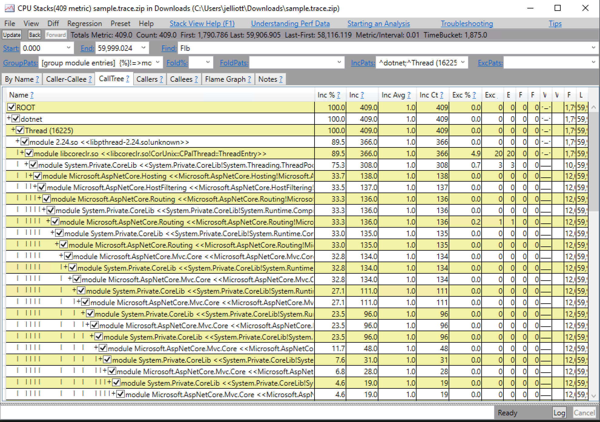
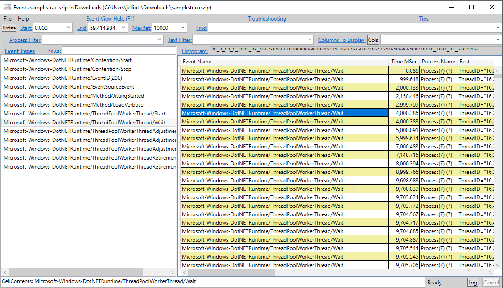
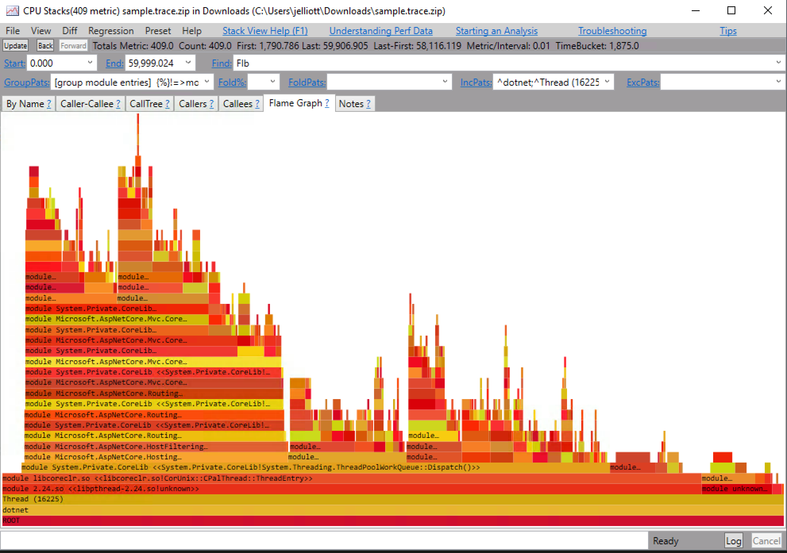

# perfcollect

[perfcollect](https://aka.ms/perfcollect) and [Perfview](https://github.com/Microsoft/perfview/blob/master/documentation/Downloading.md) are a collection of tools provided by Microsoft to analyze the behavior of running netcore processes.

The following guide will walk you through using these tools to gather events and perform cpu profiling on a live container running in Kubernetes.  Note that we will be performing our data collection from a sidecar deployed in the same pod as the container we want to debug.

Check out these guides on [cpu profiling](../cpu-profiling) and [static-tracepoints](../static-tracepoints) without using PerfView.

## Run your netcore app in K8s
Create your pod with a [debugging sidecar](https://hub.docker.com/r/joeelliott/netcore-debugging-tools).  The rest of this guide will use [perfcollect.yaml](./perfcollect.yaml) which runs a sidecar next to a simple [sample app](https://github.com/joe-elliott/sample-netcore-app).

#### Environment Variables

```
env:
- name: COMPlus_PerfMapEnabled 
  value: "1"
- name: COMPlus_EnableEventLog
  value: "1"
- name: COMPlus_ZapDisable
  value: "1"
```

`COMPlus_EnableEventLog`  Instructs netcore to produce LTTng events. 

`COMPlus_PerfMapEnabled` creates a perf map in `/tmp` that perf can read to symbolicate stack traces.

`COMPlus_ZapDisable` will force netcore runtime to be JITted.  This is normally not desirable, but it will cause the netcore runtime dll symbols to be included in the perf maps.  This will allow perf to gather symbols for both the runtime as well as your application.

There are other ways to do this if you are interested. https://github.com/dotnet/coreclr/blob/master/Documentation/project-docs/linux-performance-tracing.md#resolving-framework-symbols

#### Mount /tmp
By sharing /tmp as an empty directory the debugging sidecar can easily access perf maps created by the netcore application.

#### Mount /var/run/lttng
LTTng uses a number of files in this folder to communicate with the running process.  Sharing this folder between containers allows your sidecar to pick up events produced by your netcore app.

#### shareProcessNamespace
Setting `shareProcessNamespace` to true allows the sidecar to easily access the process you want to debug.

### 2. Run ./setup.sh
SSH to the node and run [`./setup.sh <pid on host>`](./setup.sh) with the pid of the process you want to profile as root.  This script will

- Move map files out of the container's `/tmp` directory to the host so perf can pick them up.
- Download and run `perfcollect install`

## Profile!

Exec into the sidecar and run `./setup.sh`.  The tools we are using are very tightly coupled with the kernel version you want to debug.  Because of this we can't install all of the tools we need directly in the container.  They must be installed once the container is running and the kernel version is known.  `./setup.sh` will attempt to install the rest.  If you are having issues refer to the notes on [kernel interactions](../kernel-interactions) with the container.

```
kubectl exec -it -c profile-sidecar sample-netcore-app bash
# ./setup.sh
```

Next discover the pid of the dotnet process you want to profile.  You will use it in the below examples.

```
# ps aux | grep dotnet
root         6  0.5  4.2 11940308 87108 ?      SLsl 02:46   0:06 dotnet /app/sample-netcore-app.dll
```

The perfcollect script itself will collect both stack traces and events at the same time.  The below will collect for 5 seconds.  If you leave the `collectsec` argument off you will need to Ctrl+C to interrupt `perfcollect`.  This will create a `sample.trace.zip` file which can then be viewed with [PerfView](https://github.com/Microsoft/perfview/blob/master/documentation/Downloading.md)

`./perfcollect collect sample -collectsec 5`

Exit the container and copy it locally

```
kubectl cp default/sample-netcore-app:sample.trace.zip sample.trace.zip -c profile-sidecar
```

### Warning

Perfcollect is bad about swallowing errors.  If you pull your sample.trace.zip locally and are not seeing stack traces I would recommend reviewing the `perfcollect.log` file contained in the zip.  It will show you the raw perf commands run and their outputs.

For example perfcollect supports a `-pid` parameter, but if you pass it perfcollect will fail silently:  https://github.com/dotnet/corefx-tools/issues/84.


## PerfView

Open up your `sample.trace.zip` in PerfView and explore some of the functionality.  Some sample screenshots below.





