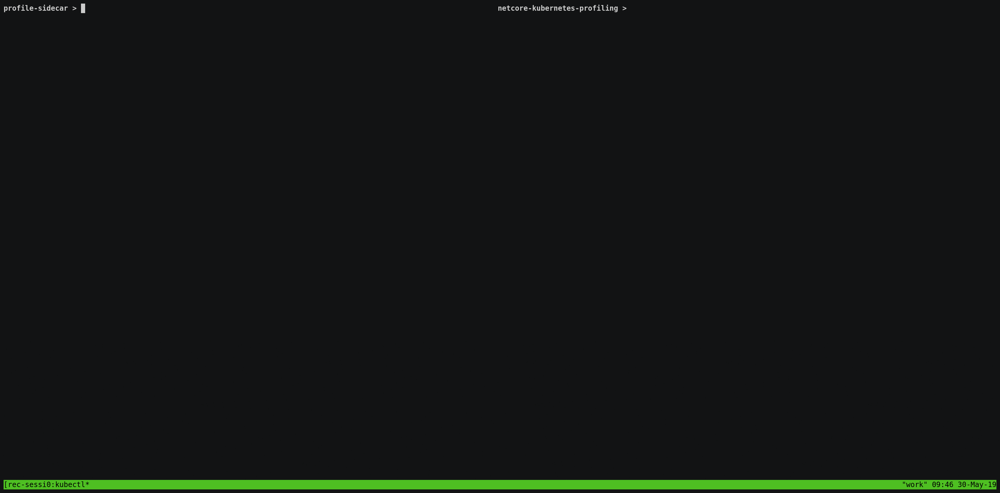

# netcore-kubernetes-profiling

This is my personal collection of notes, scripts and techniques developed to help debug live .NET Core applications.  All of these techniques were performed from a sidecar in Kubernetes.  If you are interested in profiling .NET Core applications running on Linux without Kubernetes then these guides still will contain a lot of useful information.

Feel free to ask questions, suggest changes or submit pull requests.

## Demo!

The below dynamic tracing demo was performed on [this application](https://github.com/joe-elliott/sample-netcore-app) built with [this Dockerfile](https://github.com/joe-elliott/sample-netcore-app/blob/master/Dockerfile).  Even though this application was built normally and contains no special instrumentation we can still dynamically trace any method in the application using [bcc](https://github.com/iovisor/bcc).  In the following demo we will trace [calculateFibonacciValue](https://github.com/joe-elliott/sample-netcore-app/blob/master/Providers/FibonacciProvider.cs#L9) and [calculateEchoValue](https://github.com/joe-elliott/sample-netcore-app/blob/master/Providers/EchoProvider.cs#L9).

Check out the below guides to get details on how to do this and more.

## Debugging techniques

- [cpu profiling](./cpu-profiling)
  - Building FlameGraphs from perf data
- [static tracepoints](./static-tracepoints)
  - Recording and viewing LTTng events
- [perfcollect](./perfcollect)
  - Static Tracepoints and CPU Profiling the Microsoft way
- [dynamic tracing](./dynamic-tracing)
  - Includes guides on using perf events and bcc to trace any method in an application without instrumentation

## Other information

- [images](./images)
  - A collection of Dockerfiles to build sidecar profiling containers.
- [kernel interactions](./kernel-interactions)
  - The containers, tools, and the kernel can sometimes have weird interactions.  This document contains information on how to get these tools working on a variety of kernel versions.
- [todo](./todo)
  - Future work for this repo.

Previously this repo was focused on executing these techniques from the node the application was running on.  If you are interested in that approach you can check it out [here](https://github.com/joe-elliott/netcore-kubernetes-profiling/tree/54bacfeecb33de6bbc590768af9c276efd1b4e4c).

